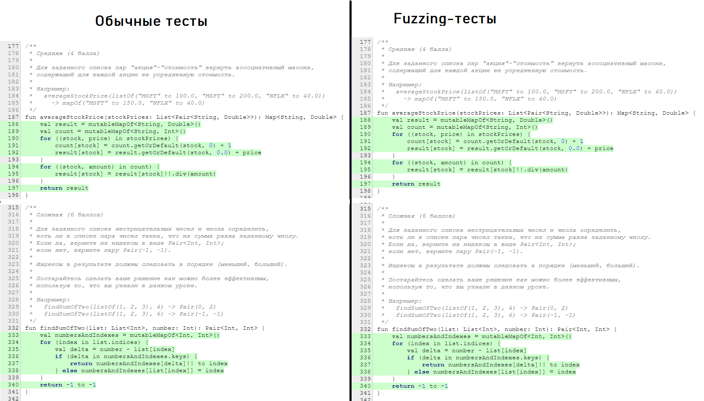

## Тестовое покрытие

Тестовое покрытие проводилось средствами IntelliJ Idea, затем сохранялось в виде `html`-страницы  и открывалось в браузере.

## Обычные тесты

Перед тем, как посмотреть на покрытие fuzzing-тестов, посмотрим на результаты покрытия обычных тестов

#### lesson5

#### lesson6

#### lesson7

## Fuzzing

Теперь посмотрим на результаты fuzzing-тестов

#### lesson5

#### lesson6

#### lesson7

## Сравнение и выводы

Видим, что покрытие` lesson5` и `lesson7` совпадает. Посмотрим на покрытие строк кода.

#### lesson5

#### lesson7

Видим, что и при использовании обычных тестов и при использовании fuzzing-тестов удалось покрыть весь код тестируемых методов

Теперь рассмотри результаты` lesson6`. Видно, что при использовании fuzzing-тестов удалось покрыть на 2 строки кода меньше. Рассмотрим результаты детальней.

#### lesson6

Видим, что в результате Fuzzing-тестов не удалось получить `NumberFormatException` в результате выполнения `bestLongJump()`. Скорее всего, это произошло потому, что в самом fuzzing-тесте при генерации строки не сгенерировались определенные краевые случаи, которые могли бы выкинуть `NumberFormatException`.

